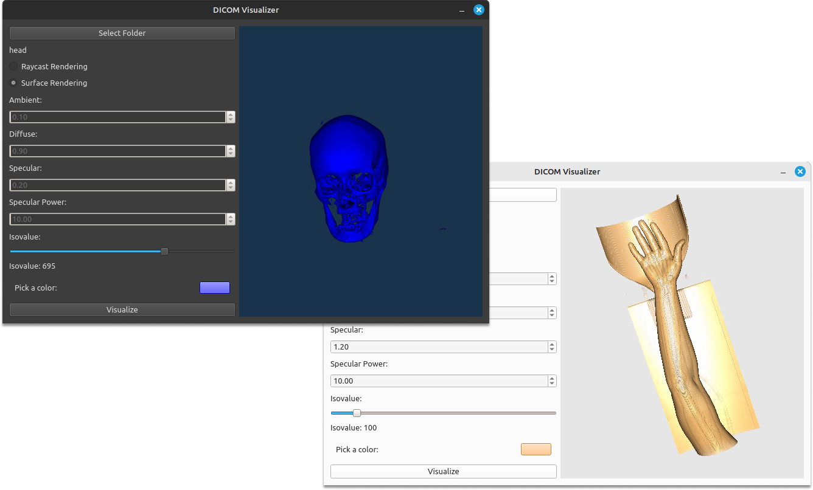

# DICOM Visualizer

DICOM Visualizer is a Python desktop application built with PyQt6 and VTK that facilitates the visualization of DICOM data in 3D. This tool empowers users to upload DICOM datasets and visualize them using two distinct rendering methods: Raycast Rendering and Surface Rendering. Additionally, users have the flexibility to fine-tune rendering parameters such as ambient, diffuse, specular, and specular power for Raycast Rendering, and ISO value for Surface Rendering. Furthermore, the application allows users to customize the color of the visualization.

<div align="center">
  
</div>

## Table of Contents

- [Features](#features)
- [Getting Started](#getting-started)
- [Usage](#usage)
- [Contributors](#contributors)

## Features

- **Upload DICOM Data:** Load DICOM datasets for 3D visualization using Raycast and Surface Rendering.

- **Raycast Rendering:** Utilize adjustable parameters for ambient, diffuse, specular, and specular power to enhance the rendering quality.

- **Surface Rendering:** Adjust the ISO value to control the rendering threshold for Surface Rendering.

- **Color Customization:** Personalize the visualization by changing the color of the rendered DICOM data.

## Getting Started

### Prerequisites

- Python 3.6 or higher
- PyQt6
- VTK

### Installation

1. Clone this repository to your local machine.

```bash
git clone https://github.com/bodykudo/DICOM-visualizer.git
```

2. Install the required dependencies.

```bash
pip install requirements.txt
```

3. Run the application.

```bash
python main.py
```

## Usage

1. **Upload DICOM Data:**

   - Click the "Select Folder" button to select a DICOM dataset for 3D visualization.

2. **Raycast Rendering:**

   - Adjust the ambient, diffuse, specular, and specular power sliders for optimal Raycast Rendering.

3. **Surface Rendering:**

   - Use the ISO value slider to control the rendering threshold for Surface Rendering.

4. **Color Customization:**

   - Modify the color settings as desired via the color picker.

## Contributors

<table>
  <tr>
    <td align="center">
    <a href="https://github.com/Bodykudo" target="_black">
    
    <br />
    <sub><b>Abdallah Magdy</b></sub></a>
    <td align="center">
    <a href="https://github.com/MahmoudMagdy404" target="_black">
    
    <br />
    <sub><b>Mahmoud Magdy</b></sub></a>
    </td>
    </td>
    <td align="center">
    <a href="https://github.com/Mahmoudm007" target="_black">
    
    <br />
    <sub><b>Mahmoud Mohamed</b></sub></a>
    </td>
    <td align="center">
   <td align="">
    <a href="https://github.com/MohamedAlaaAli" target="_black">
    
    <br />
    <sub><b>Mohamed Alaa</b></sub></a>
    </td>
    </tr>
 </table>

---

Explore the world of DICOM visualization with DICOM Visualizer!
